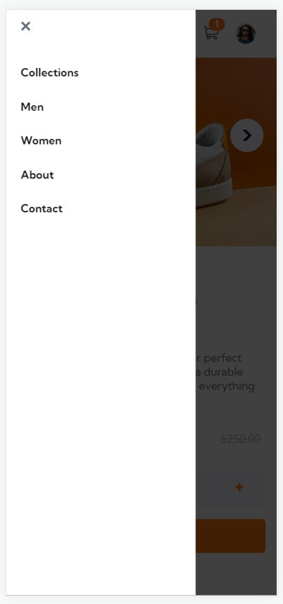

# Frontend Mentor - E-commerce product page solution

This is a solution to the [E-commerce product page challenge on Frontend Mentor](https://www.frontendmentor.io/challenges/ecommerce-product-page-UPsZ9MJp6). Frontend Mentor challenges help you improve your coding skills by building realistic projects.

## Table of contents

- [Overview](#overview)
  - [The challenge](#the-challenge)
  - [Screenshot](#screenshot)
  - [Links](#links)
- [My process](#my-process)
  - [Built with](#built-with)
  - [What I learned](#what-i-learned)
  - [Continued development](#continued-development)
  - [Useful resources](#useful-resources)
- [Author](#author)

## Overview

### The challenge

Users should be able to:

- View the optimal layout for the site depending on their device's screen size
- See hover states for all interactive elements on the page
- Open a lightbox gallery by clicking on the large product image
- Switch the large product image by clicking on the small thumbnail images
- Add items to the cart
- View the cart and remove items from it

### Screenshot





### Links

- Live Site URL: [E-commerce at Vercel](https://e-commerce-product-page-black.vercel.app/)

## My process

### Built with

- Semantic HTML5 markup
- CSS custom properties
- Mobile-first workflow
- React - JS library
- TypeScript - Programming language
- CSS Modules - For styles

### What I learned

Media query for responsive layout.

```css
@media (min-width: 800px) {
  .main {
    margin-top: 2rem;
    padding-top: 5rem;
    border-top: 1px solid hsl(220, 14%, 75%);
  }

  .pictures {
    display: inline-block;
    width: 49%;
    vertical-align: middle;
  }

  .product-info {
    vertical-align: middle;
    display: inline-block;
    width: 49%;
  }
}
```

Hook to control screen size.

```ts
const useScreen = () => {
  const [screenWidth, setScreenWidth] = useState(window.innerWidth);
  const [isMobileScreen, setIsMobileScreen] = useState(
    screenWidth < mobileScreenSize
  );

  useEffect(() => {
    const resizeHandler = () => {
      setScreenWidth(window.innerWidth);
    };
    window.addEventListener('resize', resizeHandler);

    return () => window.removeEventListener('resize', resizeHandler);
  }, []);

  useEffect(() => {
    setIsMobileScreen(screenWidth < mobileScreenSize);
  }, [screenWidth]);

  return { screenWidth: screenWidth, isMobileScreen: isMobileScreen };
};
```

Using React Portals to show backdrop and dialog.

```ts
<Backdrop onClick={props.close} />;
{
  ReactDom.createPortal(
    view,
    document.getElementById('overlay-root') as HTMLElement
  );
}
```

### Continued development

I need to explore more of responsive projects in React, to build less complex components. Use other CSS features is also importante, to make the project more beautiful and maintainable.

### Useful resources

- [Responsive Navbar Repo](https://github.com/erdemkarakas/react-sass-navbar-responsive-route-hamburger/blob/main/src/components/Navbar/index.tsx) - This helped me building the responsive navbar using React.
- [CSS - The Complete Guide 2023](https://www.udemy.com/course/css-the-complete-guide-incl-flexbox-grid-sass/) - This is an amazing CSS course that I'm doing to improve my skills.
- [React - The Complete Guide](https://www.udemy.com/course/react-the-complete-guide-incl-redux/) - This is an amazing React course that I'm doing to improve my skills.

## Author

- LinkedIn - [Winstein Martins](https://www.linkedin.com/in/winstein-martins/)
- Frontend Mentor - [@winstein27](https://www.frontendmentor.io/profile/winstein27)
